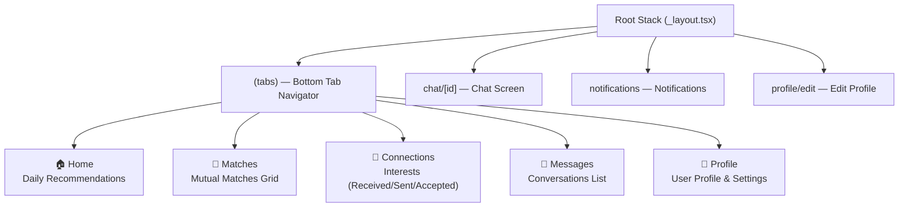
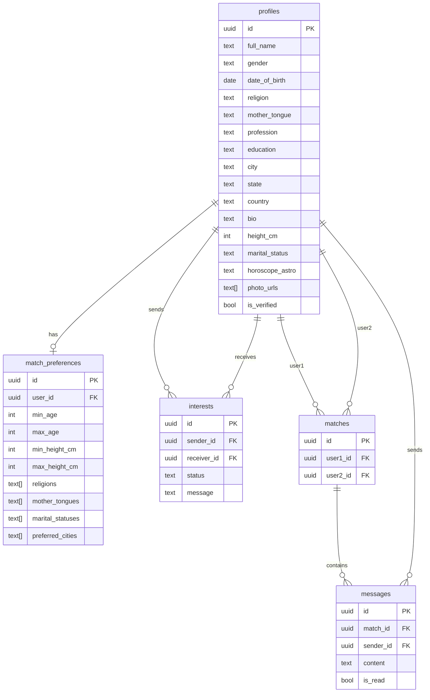

# 🧡 Hamsafar (हमसफ़र) — Project Overview

> A premium **Shadi / Matrimonial Matchmaking** mobile app built with React Native Expo & Supabase.

---

## 🏗️ Tech Stack

| Layer | Technology | Version |
|-------|-----------|---------|
| **Framework** | React Native Expo | SDK 54 |
| **React** | React 19 | 19.1.0 |
| **React Native** | — | 0.81.5 |
| **Routing** | Expo Router (file-based) | v6 |
| **Backend / Auth** | Supabase (PostgreSQL + Auth) | ^2.112.3 |
| **Secure Storage** | `expo-secure-store` | ~15.0.8 |
| **Animations** | `react-native-reanimated` | ~4.1.1 |
| **UI Effects** | `expo-blur`, `expo-linear-gradient`, `expo-image` | Latest SDK 54 |
| **Icons** | `@expo/vector-icons` (MaterialCommunityIcons) | ^15.0.3 |
| **Language** | TypeScript | ~5.9.2 |

---

## 📁 Project Structure

```
Humsafar/
├── app/                          # Expo Router — file-based navigation
│   ├── _layout.tsx               # Root Stack layout (LanguageProvider wrapper)
│   ├── index.tsx                 # Redirect → tabs
│   ├── (tabs)/                   # Bottom tab navigator
│   │   ├── _layout.tsx           # Tabs layout (StitchTabBar)
│   │   ├── index.tsx             # 🏠 Home tab
│   │   ├── matches.tsx           # 💛 Matches tab
│   │   ├── connections.tsx       # 🔗 Connections tab (center FAB)
│   │   ├── messages.tsx          # 💬 Messages tab
│   │   └── profile.tsx           # 👤 Profile tab
│   ├── chat/[id].tsx             # 💬 Individual chat screen (dynamic route)
│   ├── notifications/index.tsx   # 🔔 Notifications screen
│   └── profile/edit.tsx          # ✏️ Profile edit screen
│
├── src/
│   ├── components/
│   │   ├── common/               # Shared UI components
│   │   │   ├── ScreenWrapper.tsx          # 🌈 Gradient background wrapper (MANDATORY for all screens)
│   │   │   ├── HamsafarAppHeader.tsx      # App header with logo, notification bell
│   │   │   ├── StitchTabBar.tsx           # ❄️ Frosted glass floating tab bar (FINALIZED)
│   │   │   └── SpinningConnectionsFab.tsx # 🔄 Animated center FAB button
│   │   ├── home/
│   │   │   ├── HomeContent.tsx            # Home feed with filters & profile cards
│   │   │   ├── ProfileCard.tsx            # Full swipeable profile card
│   │   │   ├── UserMatchCard.tsx          # Compact match card
│   │   │   └── NewMatchAvatarCard.tsx     # Circular avatar for new matches
│   │   ├── matches/
│   │   │   └── MatchesContent.tsx         # Grid of mutual matches
│   │   ├── connections/
│   │   │   └── ConnectionsContent.tsx     # Received/Sent/Accepted interest tabs
│   │   ├── messages/
│   │   │   ├── MessagesContent.tsx        # Message list with search & online avatars
│   │   │   └── ConversationCard.tsx       # Reusable conversation list item
│   │   ├── notifications/
│   │   │   ├── NotificationsContent.tsx   # Notification feed with category tabs
│   │   │   └── NotificationItemCard.tsx   # Individual notification card
│   │   └── profile/
│   │       └── ProfileContent.tsx         # Profile view with edit/settings options
│   │
│   ├── constants/
│   │   └── theme.ts              # 🎨 Single source of truth for ALL design tokens
│   │
│   ├── data/
│   │   ├── mockProfiles.ts       # Mock profile data for development
│   │   └── mockNotifications.ts  # Mock notification data
│   │
│   ├── i18n/                     # 🌐 Internationalization (3 languages)
│   │   ├── index.tsx             # LanguageProvider context + useTranslation hook
│   │   ├── en.ts                 # 🇬🇧 English translations
│   │   ├── hi.ts                 # 🇮🇳 Hindi translations
│   │   └── mr.ts                 # 🇮🇳 Marathi translations
│   │
│   ├── lib/
│   │   └── supabase.ts           # Supabase client (SecureStore adapter)
│   │
│   └── types/
│       └── database.types.ts     # TypeScript interfaces for DB schema
│
├── assets/                       # App icons, splash screens, images
├── android/                      # Native Android project
├── ios/                          # Native iOS project
├── app.json                      # Expo config
├── package.json                  # Dependencies
└── AGENTS.md                     # Project rules & design system spec
```

---

## 🎨 Design System — "Vibrant Fintech System"

The app follows the **Stitch Vibrant Fintech System** strictly. All colors come from [`theme.ts`](file:///Users/swapnilshinde/Desktop/ExpoApp/Humsafar/src/constants/theme.ts).

| Token | Value | Usage |
|-------|-------|-------|
| **Primary** | `#ff6600` 🟠 | Main buttons, CTAs, active tab indicator |
| **Primary Dark** | `#a33e00` | Primary tint, headings |
| **Secondary** | `#006b55` 🟢 | Verified badges, success indicators |
| **Secondary Container** | `#6dfad2` | Accent highlights |
| **Background** | `#f4fafd` | App background |
| **Surface** | `#ffffff` | Card backgrounds |
| **On-Surface** | `#161d1f` | Primary text |
| **On-Surface-Variant** | `#5a4136` | Secondary text |
| **Background Gradient** | `['#ffe5d4', '#f0f7fb', '#d5f7ed']` | Saffron → Blue → Mint screen gradient |
| **Glass Background** | `rgba(255,255,255,0.55)` | Frosted glass tab bar |
| **Error** | `#ba1a1a` | Error states |

### Key UI Patterns
- **ScreenWrapper**: Every screen uses the Stitch gradient background (`#ffe5d4 → #f0f7fb → #d5f7ed`)
- **Cards**: White containers with `16px` border radius, `16px` padding, and soft ambient shadow
- **Tab Bar**: Frosted glass floating bar with blur effect and a spinning center FAB for "Connections"
- **Shadows**: 3 levels — card (subtle), active button (orange glow), floating glass (deep)

---

## 📱 App Screens & Navigation



### Screen Details

| Screen | Description | Key Features |
|--------|-------------|--------------|
| **Home** | Browse recommended profiles | Filter chips (All, Verified, Same Religion, Near Me), swipeable `ProfileCard` with actions (Pass/Connect/Super Like), new match avatars |
| **Matches** | View mutual matches | Grid of `UserMatchCard`s for profiles with mutual interest, "Chat Now" quick action |
| **Connections** | Manage interests | 3 sub-tabs (Received/Sent/Accepted), Accept/Decline actions on interest requests |
| **Messages** | Chat conversations | Search bar, horizontal online match avatars, `ConversationCard` list with unread badges |
| **Profile** | User profile & settings | Profile photo, stats, edit profile button, partner preferences, horoscope, language selector, logout |
| **Chat [id]** | 1-on-1 messaging | Full chat UI with message bubbles, contact unlock request flow, call button |
| **Notifications** | Activity feed | Category tabs (All/Interests/Matches/System), `NotificationItemCard` with actions |
| **Profile Edit** | Edit profile form | Full name, gender, DOB, city, state, horoscope fields, save action |

---

## 🗄️ Database Schema (Supabase PostgreSQL)



---

## 🌐 Internationalization (i18n)

The app supports **3 languages** — all LTR:

| Language | File | Status |
|----------|------|--------|
| 🇬🇧 English | [`en.ts`](file:///Users/swapnilshinde/Desktop/ExpoApp/Humsafar/src/i18n/en.ts) | ✅ Complete |
| 🇮🇳 Hindi | [`hi.ts`](file:///Users/swapnilshinde/Desktop/ExpoApp/Humsafar/src/i18n/hi.ts) | ✅ Complete |
| 🇮🇳 Marathi | [`mr.ts`](file:///Users/swapnilshinde/Desktop/ExpoApp/Humsafar/src/i18n/mr.ts) | ✅ Complete |

Translation system uses a React Context (`LanguageProvider`) with a `useTranslation()` hook and dot-path `t('key.path')` accessor with automatic English fallback.

---

## 🔐 Auth & Security

- **Supabase Auth** with email/password (configured in [`supabase.ts`](file:///Users/swapnilshinde/Desktop/ExpoApp/Humsafar/src/lib/supabase.ts))
- **expo-secure-store** for native token persistence (falls back to `localStorage` on web)
- Auto-refresh tokens enabled, session persistence enabled
- Environment variables: `EXPO_PUBLIC_SUPABASE_URL` and `EXPO_PUBLIC_SUPABASE_ANON_KEY`

---

## 🚧 Current State

| Aspect | Status |
|--------|--------|
| **UI / Screens** | ✅ All 5 tabs + 3 stack screens built with Stitch design system |
| **Design System** | ✅ Fully implemented in `theme.ts` |
| **Tab Bar** | ✅ Finalized — frosted glass with spinning FAB |
| **i18n** | ✅ 3 languages complete |
| **Mock Data** | ✅ Mock profiles & notifications for development |
| **Supabase Client** | ✅ Configured with SecureStore |
| **Auth Flow** | 🔲 Not yet implemented (no login/signup screens) |
| **Real Data** | 🔲 Using mock data — DB tables defined but not wired |
| **RLS Policies** | 🔲 Not yet applied |
| **Image Upload** | 🔲 Not yet implemented |
| **Push Notifications** | 🔲 Not yet implemented |
| **Profile Verification** | 🔲 Not yet implemented |

---

## 📋 Enforced Project Rules

> [!IMPORTANT]
> These rules are defined in [`AGENTS.md`](file:///Users/swapnilshinde/Desktop/ExpoApp/Humsafar/AGENTS.md) and must always be followed:

1. **Theme Single Source of Truth** — All colors from `theme.ts`, never hardcoded hex values
2. **ScreenWrapper Mandatory** — Every screen uses the gradient background wrapper
3. **i18n Mandatory** — All display text from translation files, never hardcoded strings
4. **Tab Bar Locked** — `StitchTabBar.tsx` is finalized and must NOT be modified
5. **ConversationCard** — Messages tab must use the dedicated reusable component
